## 视频教程
一亿ID的人脸识别训练和万亿人脸对 [视频](https://v.qq.com/x/page/o070252xe05.html) [课件](https://edu.csdn.net/course/detail/8528)

Typically, face recognition can be categorized as face identification and face verification . The former classifies a face to a specific identity, while the latter determines whether a pair of faces belongs to the same identity.

## Loss

### softmax
[人脸识别的LOSS（上）](https://zhuanlan.zhihu.com/p/34404607)

网络输出的幅值千差万别，输出最大的那一路对应的就是我们需要的分类结果。通常用百分比形式计算分类置信度，最简单的方式就是计算输出占比，假设输出特征是 [公式]，这种最直接最最普通的方式，相对于soft的max，在这里我们把它叫做hard的max：
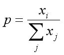
而现在通用的是soft的max，将每个输出x非线性放大到exp(x)，形式如下：

hard的max和soft的max到底有什么区别呢？看几个例子
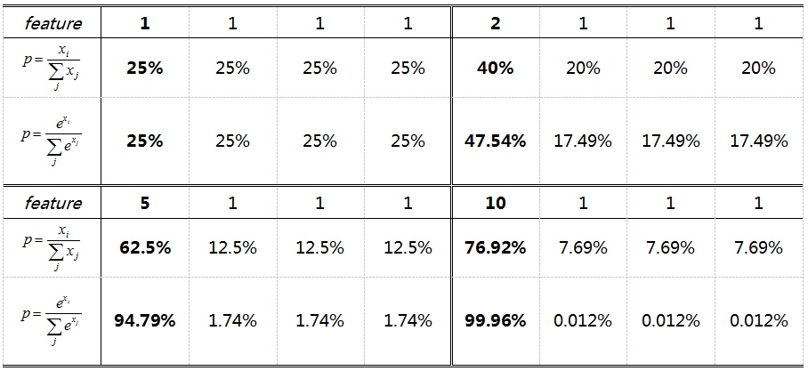

相同输出特征情况，soft max比hard max更容易达到终极目标one-hot形式，或者说，softmax降低了训练难度，使得多分类问题更容易收敛。

到底想说什么呢？Softmax鼓励真实目标类别输出比其他类别要大，但并不要求大很多。对于人脸识别的特征映射（feature embedding）来说，Softmax鼓励不同类别的特征分开，但并不鼓励特征分离很多，如上表（5，1，1，1）时loss就已经很小了，此时CNN接近收敛梯度不再下降。

Softmax Loss训练CNN，MNIST上10分类的2维特征映射可视化如下：
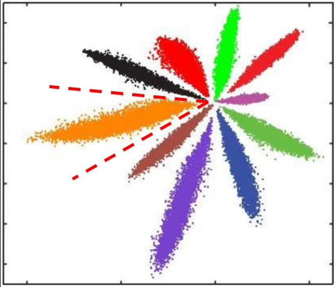
不同类别明显分开了，但这种情况并不满足我们人脸识别中特征向量对比的需求。人脸识别中特征向量相似度计算，常用欧式距离（L2 distance）和余弦距离（cosine distance），我们分别讨论这两种情况：

**L2距离**：L2距离越小，向量相似度越高。可能同类的特征向量距离（黄色）比不同类的特征向量距离（绿色）更大
  

**cos距离**：夹角越小，cos距离越大，向量相似度越高。可能同类的特征向量夹角（黄色）比不同类的特征向量夹角（绿色）更大
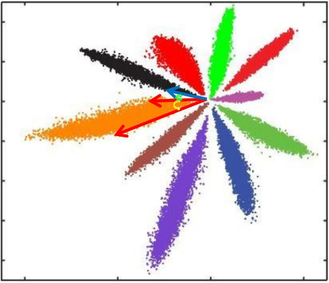 

总结来说：

+ Softmax训练的深度特征，会把整个超空间或者超球，按照分类个数进行划分，保证类别是可分的，这一点对多分类任务如MNIST和ImageNet非常合适，因为测试类别必定在训练类别中。
+ 但Softmax并不要求类内紧凑和类间分离，这一点非常不适合人脸识别任务，因为训练集的1W人数，相对测试集整个世界70亿人类来说，非常微不足道，而我们不可能拿到所有人的训练样本，更过分的是，一般我们还要求训练集和测试集不重叠。
+ 所以需要改造Softmax，除了保证可分性外，还要做到特征向量类内尽可能紧凑，类间尽可能分离。

### 双约束的Loss Function

#### Contrastive Loss
DeepID2, DeepID2+, DeepID3都在采用Softmax + Contrastive Loss
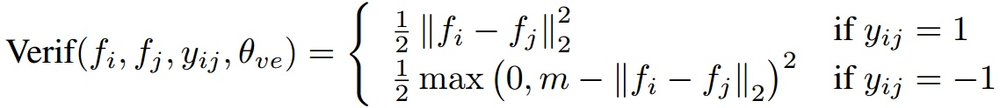
同类特征的L2距离尽可能小，不同类特征的L2距离大于margin(间隔) m，Contrastive Loss同时约束类内紧凑和类间分离。25个patch训练25个CNN，特征联合后PAC降维，训练Joint Bayesian分类，在LFW上Softmax + Contrast Loss的DeepID2达到99.15%，多层加监督信息的DeepID2+达到99.47，采用更大的deep CNN的DeepID3达到99.53%。DeepID系列是早期的深度学习人脸识别方法，但代码都没有开源，而且深度特征是多patch联合，还要训练分类器，繁琐不实用。

#### Triple Loss
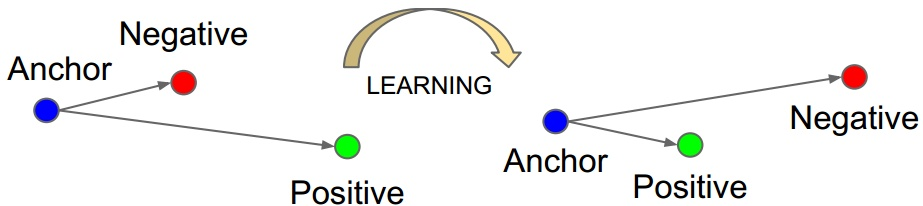
FaceNet是目前引用量最高的人脸识别方法，没有用Softmax，而是提出了Triple Loss：
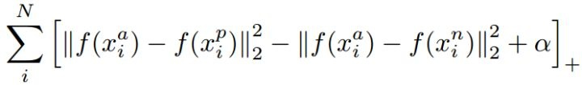
以三元组（a, p, n）形式进行优化，**不同类特征的L2距离要比同类特征的L2距离大margin m，同时获得类内紧凑和类间分离**。FaceNet用200M训练数据，仅128维特征映射，在LFW上达到了99.63%，非常犀利。但代码、模型和训练数据集都没有开源，三元组选择极具技巧性，复现非常困难。**好文推荐**！

### Largin Angular margin
+ Liu W, Wen Y, Yu Z, et al. **Large-Margin Softmax Loss for Convolutional Neural Networks** [C]// ICML, 2016.
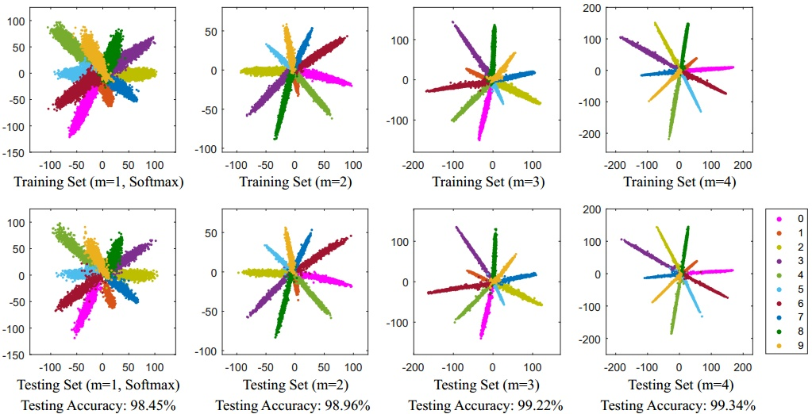
#### L-Softmax
**L-Softmax**是Large-Margin Softmax [Loss wy1iu/LargeMargin_Softmax_Loss](https://github.com/wy1iu/LargeMargin_Softmax_Loss)，是large margin系列的开创算法，首先联合FC + Softmax + Cross-entropy重新并给出了Softmax loss的表达式：
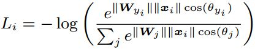
然后加强分类条件，强制让对应类别的W和x夹角增加到原来的m倍，下面看到的长得比较复杂的 [公式] 是 [公式] 的单调函数版本：
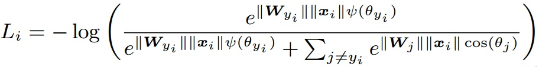
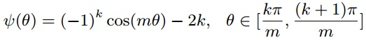

L-Softmax仅显式约束类间分离，0.49M小训练集训练17层CNN，在LFW上达到了98.71。

#### A-Softmax
+ Liu W, Wen Y, Yu Z, et al. SphereFace: Deep Hypersphere Embedding for Face Recognition [C]// CVPR. 2017.
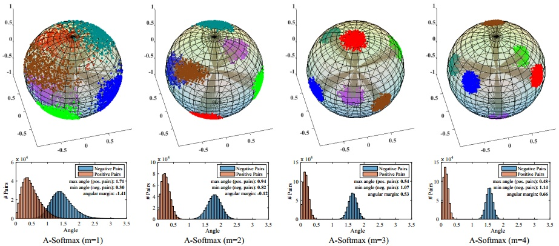
SphereFace是L-Softmax的改进 [wy1iu/sphereface](https://github.com/wy1iu/sphereface)，归一化了权值W，让训练更加集中在优化深度特征映射和特征向量角度上，降低样本数量不均衡问题，提出了A-Softmax（angular softmax）：
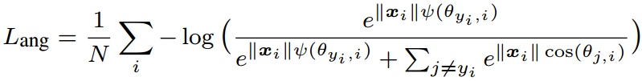

SphereFace依然仅显式约束类间分离，0.49M小训练集训练64层CNN，在LFW上达到了99.42，在大型测试集MegaFace上也做到了small的SOTA。**好文推荐**！

L-Softmax和SphereFace都采用乘性margin使不同类别更加分离，特征相似度都采用cos距离，而且都开源代码非常良心。需要注意这两个loss直接训练很难收敛，实际训练中都用到了退火方法（annealing optimization strategy）：
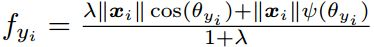

从Softmax逐渐退火到L-Softmax或A-Softmax，难以训练我猜测可能是因为这个**乘性margin太难了**。因为SphereFace中m=4，即夹角要增大到原来的四倍，难度太大导致很难收敛，而采用退火方法后，最终等价于m=1.5，相当于降低了训练难度。

目前最好，训练更简单的加性margin系列留在下一篇分解。

#### Center Loss
+ Wen Y, Zhang K, Li Z, et al. A discriminative feature learning approach for deep face recognition [C]// ECCV, 2016.
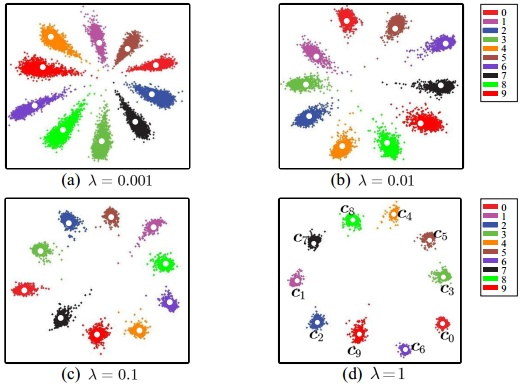
**Center Loss** [ydwen/caffe-face](https://github.com/ydwen/caffe-face)，为每个类别学习一个中心，并将每个类别的所有特征向量拉向对应类别中心，联合Softmax一起使用：
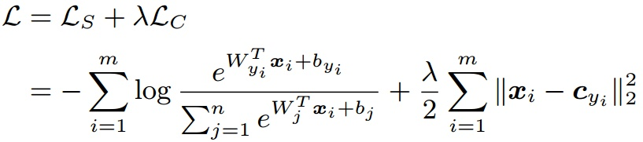

Center Loss在Softmax的基础上，仅显式约束类内紧凑，0.7M训练数据7层CNN在LFW上达到了99.28，对照SphereFace论文，0.49M训练数据64层CNN在LFW上是99.05，在大型测试集MegaFace上也做到了small的SOTA。开源代码非常良心，但Center Loss为每个类别需要保留一个类别中心，当类别数量很多（>10000）时，这个内存消耗非常可观，对GPU的内存要求较高，而且这也导致caffemodel比较大。好文推荐！

由于类内紧凑约束用了L2距离，所以我觉得特征相似度度量应该用L2距离，但论文中用了cos距离，这一点有些疑惑（或许是我理解错了）。

### 其他加约束LOSS
+ Wu Y, Liu H, Li J, et al. Deep Face Recognition with Center Invariant Loss [C]// ACM MM workshop, 2017.

**Center Invariant Loss**：首先证明了训练样本多的类别，Softmax训练后特征区域会更大，这就是训练集类别不均衡导致的分类倾向问题，Center invariant loss联合Softmax + Center loss一起使用：

## 人脸识别的LOSS（下）
[人脸识别的LOSS（下）] (https://zhuanlan.zhihu.com/p/34436551)
### Feature Normalization
+ Liu Y, Li H, Wang X. Rethinking feature discrimination and polymerization for large-scale recognition [C]// NIPS workshop, 2017.

InsightFace - 使用篇, 如何一键刷分LFW 99.80%, MegaFace 98%.
https://zhuanlan.zhihu.com/p/33750684