https://zhuanlan.zhihu.com/p/61343643
https://zhuanlan.zhihu.com/p/55479744
https://zhuanlan.zhihu.com/p/67816606
https://zhuanlan.zhihu.com/p/41738479

## 一、人脸检测与关键点检测

### 1. 问题描述：

人脸检测解决的问题为给定一张图片，输出图片中人脸的位置，即使用方框框住人脸，输出方框的左上角坐标和右下角坐标或者左上角坐标和长宽。算法难点包括：人脸大小差异、人脸遮挡、图片模糊、角度与姿态差异、表情差异等。而关键检测则是输出人脸关键点的坐标，如左眼（x1，y1）、右眼（x2，y2）、鼻子（x3，y3）、嘴巴左上角（x4，y4）、嘴巴右上角（x5，y5）等。


## 二、人脸对齐（部分参考于GraceDD的博客文章）

人脸对齐通过人脸关键点检测得到人脸的关键点坐标，然后根据人脸的关键点坐标调整人脸的角度，使人脸对齐，由于输入图像的尺寸是大小不一的，人脸区域大小也不相同，角度不一样，所以要通过坐标变换，对人脸图像进行归一化操作。人脸关键点检测有很多算法可以使用包括：ASM、AAM、DCNN 、TCDCN 、MTCNN 、TCNN、TCNN等，这里就不详细介绍，主要说一下得到人脸关键点之后如何进行人脸对齐，是所有人脸达到归一化效果，该过程如下图所示：
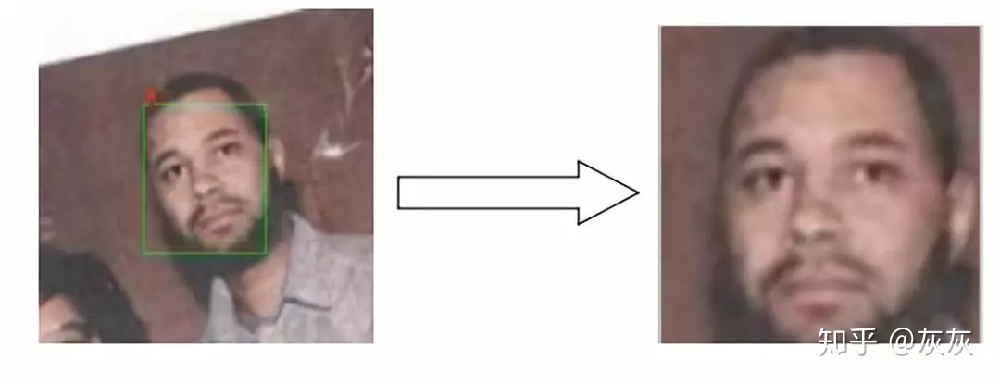

该过程涉及到图像的仿射变换，简单来说，“仿射变换”就是：“线性变换”+“平移”，即坐标的变换。假如我们希望人脸图片归一化为尺寸大小600*600，左眼位置在（180，200），右眼位置在（420，200）。 这样人脸中心在图像高度的1/3位置，并且两个眼睛保持水平，所以我们选择左眼角位置为( 0.3*width, height / 3 )，右眼角位置为（0.7*width , height / 3） 。


利用这两个点计算图像的变换矩阵（similarity transform），该矩阵是一个2*3的矩阵，如下：
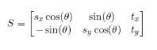
如果我们想对一个矩形进行变换，其中x、y方向的缩放因为分别为sx，sy，同时旋转一个角度 ，然后再在x方向平移tx, 在y方向平移ty

利用opencv的estimateRigidTransform方法，可以获得这样的变换矩阵，但遗憾的是，estimateRigidTransform至少需要三个点，所以我们需要构选第三个点，构造方法是用第三个点与已有的两个点构成等边三角形，这样第三个点的坐标为： 
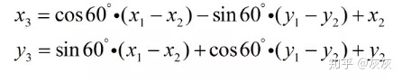
代码如下：
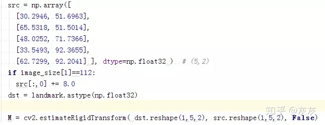
经过上一步的处理之后，所有的图像都变成一样大小，并且又三个关键点的位置是保持一致的，但因为除了三个点对齐了之外，其他点并没有对齐。所以根据得到的变换矩阵对剩下所有的点进行仿射变换，opencv代码如下所示：

img为输入图像;

warped为变换后图像，类型与src一致;

M为变换矩阵，需要通过其它函数获得，当然也可以手动输入;

Image_size为输出图像的大小;

## 三、 总结

本期文章主要介绍了人脸检测与对齐的相关算法，下一期我给大家介绍一下人脸表征的相关算法，即通过深度学习提取人脸特征，通过比较人脸特征进行人脸识别与验证。


## 从零开始搭建人脸识别系统（二）：人脸对齐
设想这样一种情况，图片中的脸相对于图片是斜的:（下面的图由于人脸关键点比较小可能看不清楚，可以打开原图可以看到标识的关键点）。
```python
import cv2
import matplotlib.pyplot as plt
import numpy as np

img_file = '../tests/asset/images/roate.jpg'
img = cv2.imread(img_file)
img = cv2.cvtColor(img, cv2.COLOR_RGB2BGR)
plt.figure(figsize=(10, 10))
plt.imshow(img)
plt.show()
```


首先我们加载mtcnn模型
```python
import mtcnn
from mtcnn.utils import draw


# First we create pnet, rnet, onet, and load weights from caffe model.
pnet, rnet, onet = mtcnn.get_net_caffe('../output/converted')

# Then we create a detector
detector = mtcnn.FaceDetector(pnet, rnet, onet, device='cpu')
../mtcnn/network/mtcnn_pytorch.py:9: UserWarning: nn.init.xavier_uniform is now deprecated in favor of nn.init.xavier_uniform_.
  nn.init.xavier_uniform(m.weight.data)
../mtcnn/network/mtcnn_pytorch.py:10: UserWarning: nn.init.constant is now deprecated in favor of nn.init.constant_.
  nn.init.constant(m.bias, 0.1)
```
检测人脸并标出关键点
```python
img = cv2.imread(img_file)
boxes, landmarks = detector.detect(img, minsize=24)
face = draw.crop(img, boxes=boxes, landmarks=landmarks)[0]
face = cv2.cvtColor(face, cv2.COLOR_RGB2BGR)
plt.figure(figsize=(5, 5))
plt.imshow(face)
plt.show()
```
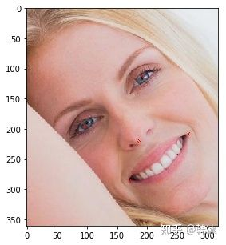
接下来我们就来讲解如何进行人脸对齐
首先假设我们最后要截取一张（112，96）大小的正脸，那么人脸的五个关键点分别在什么位置才算是正脸呢？所以我们需要五个参考点。
``` python
# Define the correct points.
REFERENCE_FACIAL_POINTS = np.array([
    [30.29459953,  51.69630051],
    [65.53179932,  51.50139999],
    [48.02519989,  71.73660278],
    [33.54930115,  92.3655014],
    [62.72990036,  92.20410156]
], np.float32)

# Lets create a empty image|
empty_img = np.zeros((112,96,3), np.uint8) 
draw.draw_landmarks(empty_img, REFERENCE_FACIAL_POINTS.astype(int))

plt.figure(figsize=(5, 5))
plt.imshow(empty_img)
plt.show()
```
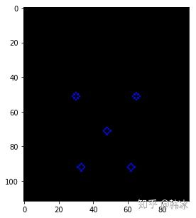
那么我们图片中的人脸在什么位置呢
```python
img_copy = img.copy()
landmark = landmarks[0]

img_copy[:112, :96, :] = empty_img
img_copy = cv2.cvtColor(img_copy, cv2.COLOR_RGB2BGR)
draw.draw_landmarks(img_copy, landmark)

plt.figure(figsize=(15, 15))
plt.imshow(img_copy)
plt.show()
```
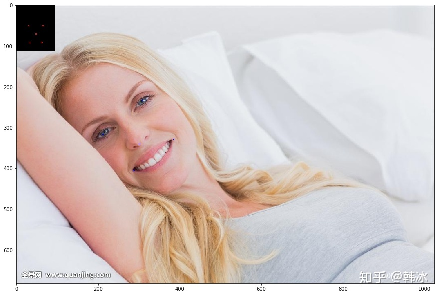
所以我们需要一个由蓝色点坐标到红色点坐标的一个仿射变换。那么什么是仿射变换呢，可以参考这篇[文章](https://www.cnblogs.com/bnuvincent/p/6691189.html)
有了仿射变换的基础知识之后，我们知道通过三个原始点和三个对应的参考点我们就可以确定一个变换矩阵，将图片中人脸移动并对其在上图的黑色区域中。最简单的想法是我们就取眼睛和鼻子和其所对应的三个点计算变换矩阵。
```python
trans_matrix = cv2.getAffineTransform(landmark[:3].cpu().numpy().astype(np.float32), REFERENCE_FACIAL_POINTS[:3])
```
接下来我们使用这个矩阵对原图像进行变换得到如下结果

```python
aligned_face = cv2.warpAffine(img.copy(), trans_matrix, (112, 112))
aligned_face = cv2.cvtColor(aligned_face, cv2.COLOR_RGB2BGR)

plt.figure(figsize=(5, 5))
plt.imshow(aligned_face)
plt.show()

```
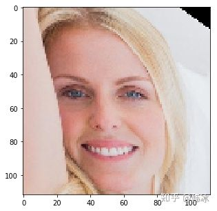
我们看到人脸已经被大致对其了，但是效果似乎不是很理想，人脸有一些变形。

### 接下来我们实现一个稍微复杂一点的对其算法

上面这个简单的算法有几个问题。一是我们有5个点的对应关系，却只用了三个。二是上述操作可能会造成对图像的拉伸变换，这样会使图像变形。怎么解决这个问题呢？
### 首先我们先来回顾一下怎样做一个仿射变换

如果我们想对一个图像在x轴方向平移 tx 个像素，在y轴方向平移ty个像素，我们的变换矩阵长什么样子呢？
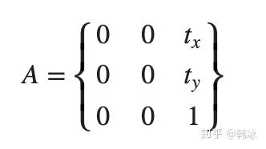
如果我们想顺时针旋转一定角度呢
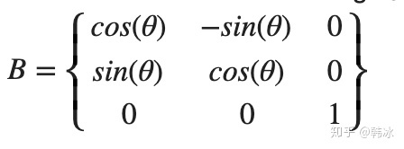
同时平移和旋转呢
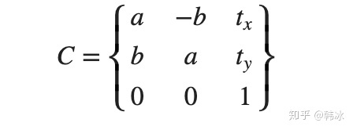
所以我们有mtcnn输出的关键点 
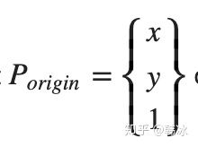
参考关键点
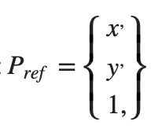
我们就可以通过下面的等式解出我们的未知参数,a,b,tx,ty
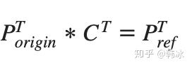
该等式进一步变形就可以写成关于a,b,tx,ty的线性方程
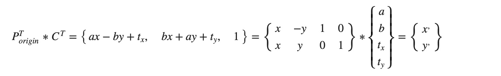

此时，我们可以用最小二乘法来对参数进行估计。（可以用numpy的内置函数 numpy.linalg.lstsq）

下面是具体代码实现
```python
from numpy.linalg import inv, norm, lstsq
from numpy.linalg import matrix_rank as rank

def findNonreflectiveSimilarity(uv, xy, K=2):

    M = xy.shape[0]
    x = xy[:, 0].reshape((-1, 1))  # use reshape to keep a column vector
    y = xy[:, 1].reshape((-1, 1))  # use reshape to keep a column vector

    tmp1 = np.hstack((x, y, np.ones((M, 1)), np.zeros((M, 1))))
    tmp2 = np.hstack((y, -x, np.zeros((M, 1)), np.ones((M, 1))))
    X = np.vstack((tmp1, tmp2))

    u = uv[:, 0].reshape((-1, 1))  # use reshape to keep a column vector
    v = uv[:, 1].reshape((-1, 1))  # use reshape to keep a column vector
    U = np.vstack((u, v))

    # We know that X * r = U
    if rank(X) >= 2 * K:
        r, _, _, _ = lstsq(X, U)
        r = np.squeeze(r)
    else:
        raise Exception('cp2tform:twoUniquePointsReq')

    sc = r[0]
    ss = r[1]
    tx = r[2]
    ty = r[3]

    Tinv = np.array([
        [sc, -ss, 0],
        [ss,  sc, 0],
        [tx,  ty, 1]
    ])


    T = inv(Tinv)

    T[:, 2] = np.array([0, 0, 1])

    T = T[:, 0:2].T

    return T

similar_trans_matrix = findNonreflectiveSimilarity(landmark.cpu().numpy().astype(np.float32), REFERENCE_FACIAL_POINTS)

aligned_face = cv2.warpAffine(img.copy(), similar_trans_matrix, (112, 112))
aligned_face = cv2.cvtColor(aligned_face, cv2.COLOR_RGB2BGR)

plt.figure(figsize=(5, 5))
plt.imshow(aligned_face)
plt.show()
```
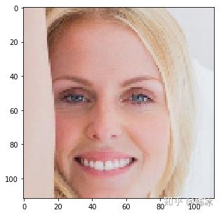