# 人脸识别损失函数简介与Pytorch实现：ArcFace、SphereFace、CosFace
#### [Link](https://zhuanlan.zhihu.com/p/60747096)

一般来说，人脸识别分三步走：

+ 找人脸：图片中找出含人脸的区域框出来对
+ 齐人脸：将人脸的眼镜鼻子嘴巴等标出来，以此作为依据对齐人脸
+ 识别：将对齐的人脸进行识别，判定这张脸究竟是谁


本篇要介绍的损失函数，用于第三步骤，聚焦于更准确地识别这张脸究竟属于谁，本质上属于一个分类问题。


一言以蔽之ArcFace、SphereFace、CosFace三个损失函数相对于前辈们而言，改进的一个核心思路就是：

**只有平常（train）更刻苦的训练，才有可能在比赛中（test）中得到更好的结果。**

它们都对卷积神经网络提出了更高的目标，在训练阶段更为艰难，也因此让其成为了一个更好的分类器。

## 一、从前辈说起
首先谈谈他们的前辈：**softmax**

维基百科介绍：

Softmax函数，或称归一化指数函数[1]，是逻辑函数的一种推广。它能将一个含任意实数的K维向量z “压缩”到另一个K维实向量$\sigma$($\mathbb z$) 中，使得每一个元素的范围都在 $\sigma$($\mathbb z$)之间，并且所有元素的和为1。该函数的形式通常按下面的式子给出：
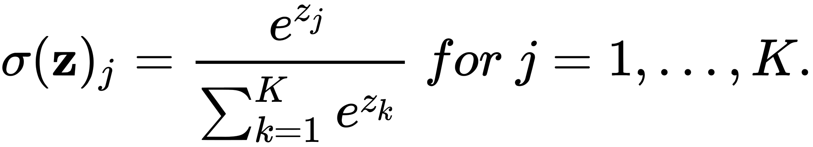
简单来说 softmax 将一组向量进行压缩，使得到的向量各元素之和为 1，而压缩后的值便可以作为置信率，所以常用于分类问题。另外，在实际运算的时候，为了避免上溢和下溢，在将向量丢进softmax之前往往先对每个元素减去其中最大值，即：

再谈谈一个容易搞混的东西：**Softmax loss**

上面我们丢入一个长度为 $\mathbb K$ 的 $\mathbb z$ 向量，得到$\sigma$ ，而softmax loss呢，则是：
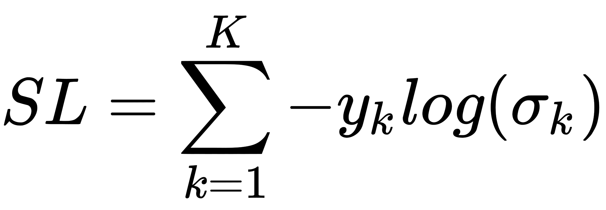

其中 $y_k$ 是一个长度为 $\mathbb K$ 的one-hot向量，即$y_k$ $\in${0,1} ，只有ground truth对应的 $y_k$=1 。所以也可以简写为：
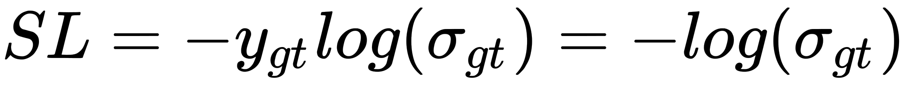
到这里我们不妨在看看交叉熵 **CrossEntropy**：
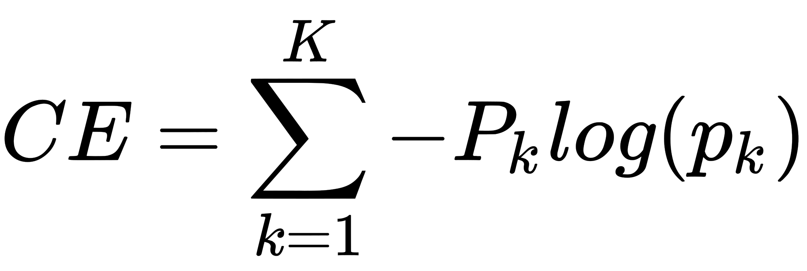
其中 $\mathbb P$ 是真实分布，在分类任务中， $\mathbb P$ 实际上等价于上面的 $\mathbb y$ 。而 $\mathbb p$ 则是预测分布，在分类任务中 $\mathbb p$ 实际上等价于上面的 $\sigma$ 。这样一来进行化简就得到：
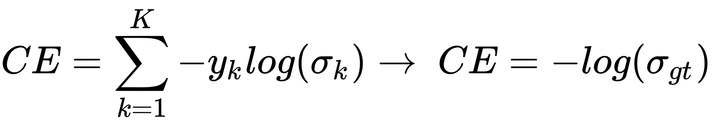

我咋觉得这么眼熟呢...
**CE=SL**
所以，我们可以得到：
**SoftMax Loss = CrossEntropy(Softmax)**

## 二、SphereFace
要想增强 SoftMax 的分类能力，其实就是要在分布上做到两点：

+ 让同类之间距离更近
+ 让不同类之间距离更远

不妨继续看看**SoftMax Loss**：
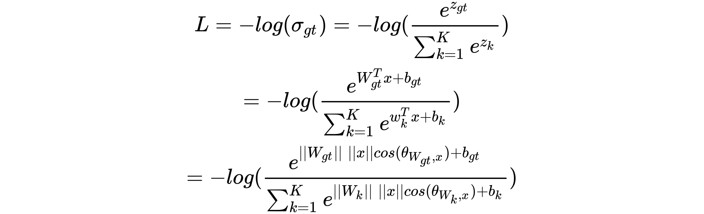

其中 $\theta_{i,j}$ $\in${0,$\pi$} 代表两个向量 ${i,j}$ 之间的夹角，如果对 $W_k$ 归一化，将偏置 $b$ 置为0，即||$W_k$||=1,$b_k$=1 ，则有：
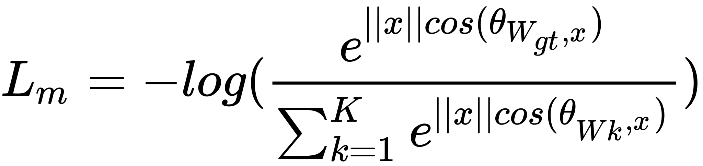
下标 $m$ 表示 $modified$ 
对于 $\theta$ 我们乘上一个大于等于1的整数 $m$：
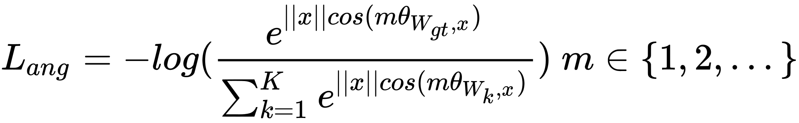

这样不仅放大了类之间的距离，也因放大了同类 $W_{gt}^T$ 与 $x$ 之间的间隔而使类内更聚拢。


不过上述公式仍有问题：原来的 $\theta_{i,j}\in(0,\pi)$ ，如今 $m\theta_{i,j}\in(0,m\pi)$ 超出了向量之间的夹角函数 $cos$ 定义域范围 $(0,\pi)$咋办？

那就变个函数呗，把n个cos怼起来变成一个递减的连续的函数：
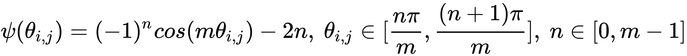
这样一来：
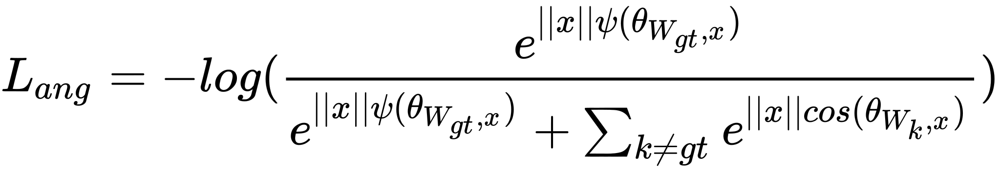
如此我们就得到了SphereFace的损失函数 $A-SoftMax$

原论文则是：


其中$i$表示第$i$个样本， $y_i$ 表示第$i$个样本的$groundthruth$标签，$\theta_{j,i}$ 表示第 $W_j$和样本 $x_i$ 之间的夹角。
论文中的可视化图片：
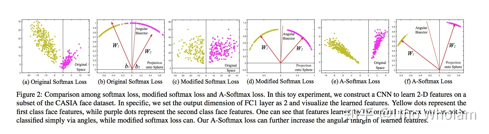
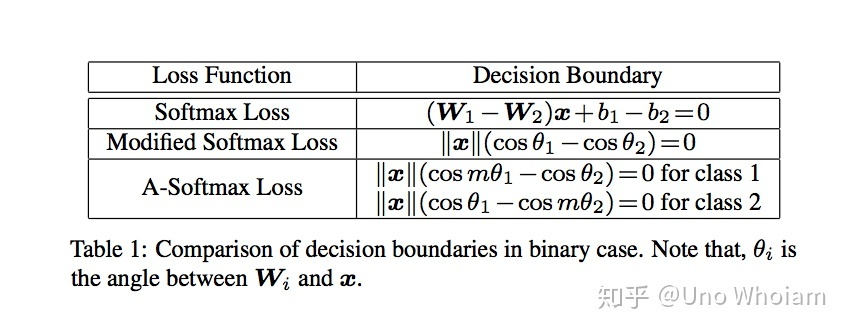
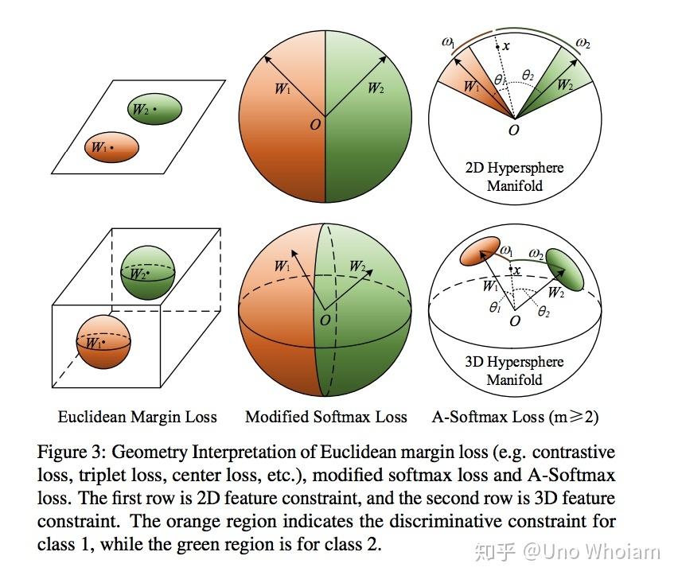
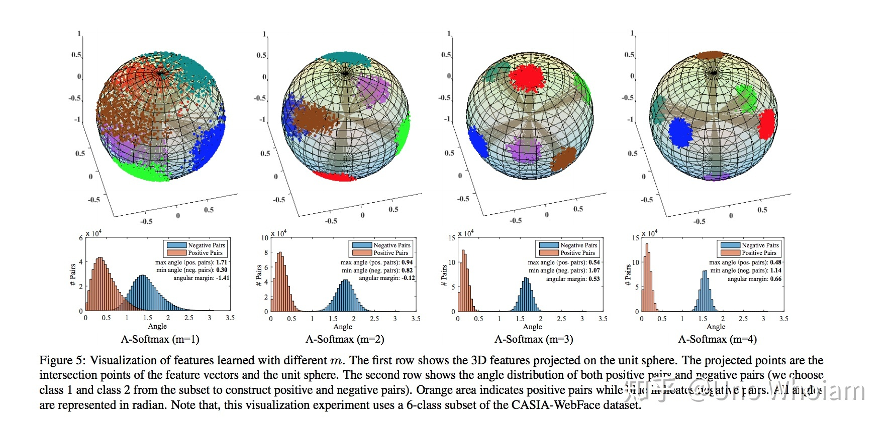
```python
# SphereFace
class SphereProduct(nn.Module):
    r"""Implement of large margin cosine distance: :
    Args:
        in_features: size of each input sample
        out_features: size of each output sample
        m: margin
        cos(m*theta)
    """

    def __init__(self, in_features, out_features, m=4):
        super(SphereProduct, self).__init__()
        self.in_features = in_features
        self.out_features = out_features
        self.m = m
        self.base = 1000.0
        self.gamma = 0.12
        self.power = 1
        self.LambdaMin = 5.0
        self.iter = 0
        self.weight = Parameter(torch.FloatTensor(out_features, in_features))
        nn.init.xavier_uniform(self.weight)

        # duplication formula
        # 将x\in[-1,1]范围的重复index次映射到y\[-1,1]上
        self.mlambda = [
            lambda x: x ** 0,
            lambda x: x ** 1,
            lambda x: 2 * x ** 2 - 1,
            lambda x: 4 * x ** 3 - 3 * x,
            lambda x: 8 * x ** 4 - 8 * x ** 2 + 1,
            lambda x: 16 * x ** 5 - 20 * x ** 3 + 5 * x
        ]
        """
        执行以下代码直观了解mlambda
        import matplotlib.pyplot as  plt

        mlambda = [
            lambda x: x ** 0,
            lambda x: x ** 1,
            lambda x: 2 * x ** 2 - 1,
            lambda x: 4 * x ** 3 - 3 * x,
            lambda x: 8 * x ** 4 - 8 * x ** 2 + 1,
            lambda x: 16 * x ** 5 - 20 * x ** 3 + 5 * x
        ]
        x = [0.01 * i for i in range(-100, 101)]
        print(x)
        for f in mlambda:
            plt.plot(x,[f(i) for i in x])
            plt.show()
        """

    def forward(self, input, label):
        # lambda = max(lambda_min,base*(1+gamma*iteration)^(-power))
        self.iter += 1
        self.lamb = max(self.LambdaMin, self.base * (1 + self.gamma * self.iter) ** (-1 * self.power))

        # --------------------------- cos(theta) & phi(theta) ---------------------------
        cos_theta = F.linear(F.normalize(input), F.normalize(self.weight))
        cos_theta = cos_theta.clamp(-1, 1)
        cos_m_theta = self.mlambda[self.m](cos_theta)
        theta = cos_theta.data.acos()
        k = (self.m * theta / 3.14159265).floor()
        phi_theta = ((-1.0) ** k) * cos_m_theta - 2 * k
        NormOfFeature = torch.norm(input, 2, 1)

        # --------------------------- convert label to one-hot ---------------------------
        one_hot = torch.zeros(cos_theta.size())
        one_hot = one_hot.cuda() if cos_theta.is_cuda else one_hot
        one_hot.scatter_(1, label.view(-1, 1), 1)

        # --------------------------- Calculate output ---------------------------
        output = (one_hot * (phi_theta - cos_theta) / (1 + self.lamb)) + cos_theta
        output *= NormOfFeature.view(-1, 1)

        return output

    def __repr__(self):
        return self.__class__.__name__ + '(' \
               + 'in_features=' + str(self.in_features) \
               + ', out_features=' + str(self.out_features) \
               + ', m=' + str(self.m) + ')'
```
## 三、CosFace