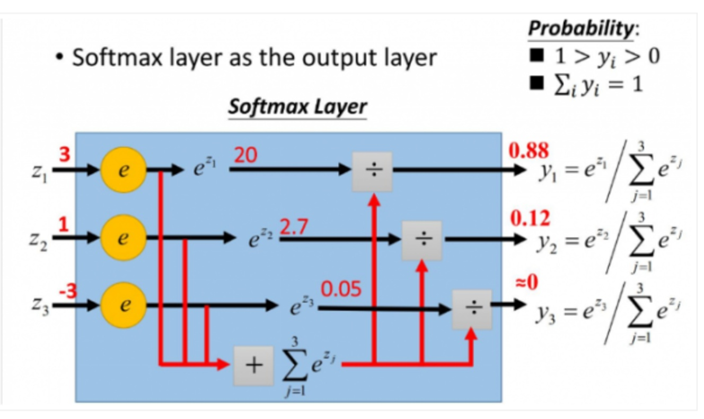
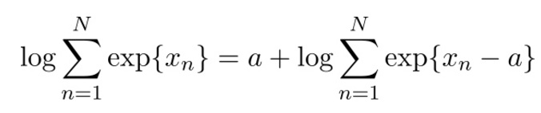
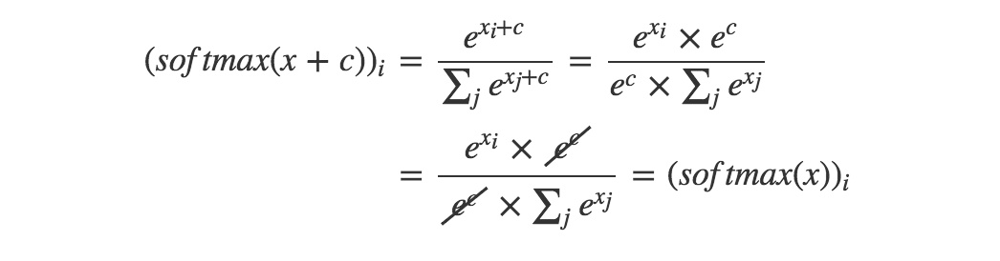

# softmax函数计算时候为什么要减去一个最大值？
## 一、softmax回顾
### [from Link](https://zhuanlan.zhihu.com/p/29376573)
首先我们给出softma层的回顾。

softmax用于多分类过程中，它将多个神经元的输出，映射到（0,1）区间内，可以看成概率来理解，从而来进行多分类！
假设我们有一个数组，V，Vi表示V中的第i个元素，那么这个元素的softmax值就$S_i$ = $e^i$/$\sum_{j=1}$($e^j$)

更形象的如下图表示：

softmax直白来说就是将原来输出是3,1,-3通过softmax函数一作用，就映射成为(0,1)的值为(0.88,0.12,0)，而这些值的累和为1（满足概率的性质），那么我们就可以将它理解成概率，在最后选取输出结点的时候，我们就可以选取概率最大（也就是值对应最大的）结点，作为我们的预测目标！
## 二、存在问题

当我们运算比较小的值的时候是不会有什么问题的，但是如果运算的值比较大的时候，比如$x_n$很大或很小的时候，朴素的直接计算会上溢出或下溢出，从而导致严重问题。

举个例子，对于[3,1,-3]，直接计算是可行的，我们可以得到(0.88,0.12,0)。

但对于[1000,1000,1000]，却并不可行，我们会得到inf(这也是深度学习训练过程常见的一个错误，看了本文之后，以后出现inf的时候，至少可以考虑softmax运算的上溢和下溢)；对于[-1000,-999,-1000]，还是不行，我们会得到-inf。

这是因为你的浮点数只有64位，在计算指数函数的环节，exp{1000} =inf，会发生上溢出；exp{-1000} =0，会发生下溢出。
## 三、解决办法

解决办法很简单：

对任意a都成立，这意味着我们可以自由地调节指数函数的指数部分，一个典型的做法是取x1,x2.....xn中的最大值：a=max{x1,x2.....xn}

这可以保证指数最大不会超过0，于是你就不会上溢出。即便剩余的部分下溢出了，加了a之后，你也能得到一个合理的值。
四、正确性证明

证明softmax不受输入的常数偏移影响，即

softmax(x)=softmax(x+c)

也就是证明加了偏移c之后，对整个softmax层的作用不起影响。如下：

希望对你理解有帮助~

[从最优化的角度看待Softmax损失函数](https://zhuanlan.zhihu.com/p/45014864)
[Softmax理解之二分类与多分类](https://zhuanlan.zhihu.com/p/45368976)
[Softmax理解之Smooth程度控制](https://zhuanlan.zhihu.com/p/49939159)
[Softmax理解之margin](https://zhuanlan.zhihu.com/p/52108088)